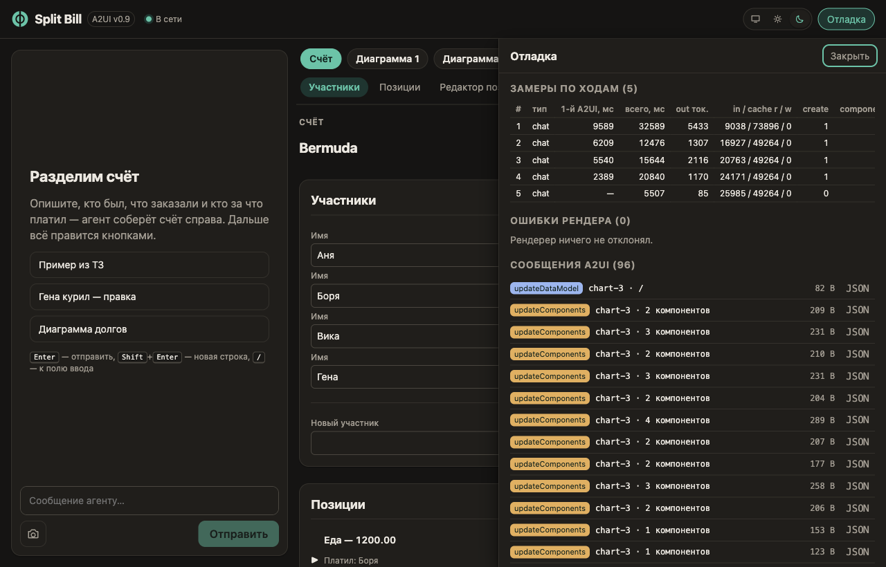

# Split Bill на A2UI v0.9 (участник №2)

Приложение для дележа счёта из ТЗ хакатона ([`TZ.md`](TZ.md)), собранное на **Google A2UI v0.9**: агент (LLM) описывает интерфейс декларативным JSON из базового каталога компонентов, клиент рисует его нативно через `@a2ui/react`. Деньги считает код, модель только вызывает тулы и рисует результат.

- Модель: по умолчанию `MiniMaxAI/MiniMax-M2.7` через [Dahl API](#модель-через-dahl-api-по-умолчанию) (меняется через `DAHL_MODEL`). Альтернативы: Claude `claude-opus-5-5` (`LLM_PROVIDER=anthropic`, `ANTHROPIC_MODEL`) и локальная модель через Ollama (`LLM_PROVIDER=ollama`, см. [ниже](#локальная-модель-через-ollama)).
- Стек: тонкий TypeScript — Node + Express + `@anthropic-ai/sdk` (tool runner, стриминг, Claude/Ollama; к Dahl сервер ходит через `fetch` и тот же интерфейс tool runner) на сервере, Vite + React 19 + `@a2ui/react@0.12` / `@a2ui/web_core@0.12` на клиенте. ADK/A2A не используются.
- Отчёт: [`REPORT.md`](REPORT.md). Сценарий демо: [`docs/DEMO.md`](docs/DEMO.md).

## Запуск одной командой

Нужны Node ≥ 22 и ключ Dahl API: впишите его в `.env` как `DAHL_API_KEY` (см. «Модель через Dahl API»). Claude (`LLM_PROVIDER=anthropic`: `ant auth login` или `ANTHROPIC_API_KEY`) и локальная модель (`LLM_PROVIDER=ollama`, см. «Локальная модель через Ollama») — альтернативы.

```bash
cp .env.example .env          # затем впишите DAHL_API_KEY
npm install && npm run dev
```

`npm run dev` запускает сервер (порт 8787) и клиент. Откройте URL, который напечатает процесс `web`:

- обычно это Vite dev server `http://localhost:5173` (проксирует `/api` на 8787);
- если в пути к проекту есть `#` (например `~/workspaces/#hakaton/...`), Vite dev server не работает — скрипт сам переключается на `vite build --watch`, а приложение открывается на `http://localhost:8787`.

## Модель через Dahl API (по умолчанию)

По умолчанию агент работает на моделях [Dahl](https://inference.dahl.global/docs/api/): OpenAI-совместимый API `https://inference.dahl.global/v1`. Anthropic-совместимого эндпоинта у Dahl нет, поэтому сервер ходит туда через `fetch` (`POST /v1/chat/completions`, SSE) и приводит ответ к тому же интерфейсу tool runner, что и у Claude: те же тулы, тот же `render_surface`, та же история (`server/src/agent/dahl.ts`, преобразования форматов — `dahl-wire.ts`).

**1. Ключ и модель.** Добавьте в `.env`:

```bash
DAHL_API_KEY=...                       # без ключа чат отвечает ошибкой
# DAHL_MODEL=MiniMaxAI/MiniMax-M2.7    # по умолчанию
# DAHL_BASE_URL=https://inference.dahl.global/v1
```

Актуальный список моделей: `curl https://inference.dahl.global/v1/models` (без ключа). На 2026-10-09 живы `MiniMaxAI/MiniMax-M2.7` (по умолчанию, контекст 180K), `deepseek-ai/DeepSeek-V4-Flash-0731` и `zai-org/GLM-5.3-Flash` (по 400K); tool calling документирован для MiniMax и DeepSeek Flash. Агенту нужна модель с tool calling.

**2. Запуск и проверка.**

```bash
npm run dev
curl localhost:8787/api/health        # {"ok":true,"provider":"dahl","model":"MiniMaxAI/MiniMax-M2.7","vision":false}
npm -w server run probe:dahl          # живая проверка API (стриминг, вызовы тулов, формат ошибок) → bench/probe-dahl-*.json
npm -w server run smoke:s1            # S1 + S6 на Dahl, таблица PASS/FAIL
```

В логе сервера при старте: `[config] resolved {… "provider":"dahl" …}`, затем `[agent.llm] dahl ready {…}` — или предупреждение `dahl preflight` с тем, что исправить (нет ключа, ключ не принят, модели нет в `/v1/models`).

**Ограничения.**

- Нет vision ни у одной модели Dahl: кнопка «Фото чека» (S9) отвечает ошибкой 422 «… не читает изображения» — опишите чек текстом. Для фото переключитесь на `LLM_PROVIDER=anthropic` или на Ollama с vision.
- Нет кеша промпта, `ANTHROPIC_EFFORT` и `ANTHROPIC_FALLBACKS` не применяются. `cacheRead` в телеметрии заполняется, только если сервер вернул `prompt_tokens_details.cached_tokens`.
- Стриминг S10 зависит от того, как сервер Dahl отдаёт аргументы тула: по частям — дерево рисуется по ходу генерации, одним куском — сразу целиком. Что делает выбранная модель, показывает `probe:dahl` (`toolStream.tools[].argChunks`).
- Рассуждения модели (`<think>…</think>`, `reasoning_content`) не попадают ни в чат, ни в историю.
- Сеть: 502/503/504 и сетевые ошибки до начала ответа повторяются 2 раза (через 0,5 и 1,5 с); если 120 с нет данных, запрос обрывается.
- Качество дерева A2UI, число исправлений после валидации и скорость зависят от модели. Цифры в `REPORT.md` измерены на Claude.

**Если что-то не так.**

| Сообщение / симптом | Причина | Что сделать |
|---|---|---|
| «Не задан DAHL_API_KEY» | в `.env` нет ключа | добавить `DAHL_API_KEY`, перезапустить сервер |
| «Dahl не принял ключ (401)» | ключ неверный или просрочен | проверить ключ, перезапустить сервер |
| «У ключа Dahl закончились токены (402)» | баланс исчерпан | пополнить баланс или выделить токены из пула |
| «Слишком много запросов к Dahl» (429) | лимит запросов | подождать минуту |
| «Модель … сейчас не доступна в Dahl» (400) | `DAHL_MODEL` нет среди живых | `curl https://inference.dahl.global/v1/models`, поправить `DAHL_MODEL` |
| «Dahl временно недоступен (503)» | перегрузка узла | повторить через пару секунд; статус — `GET /v1/status` |
| «Нет соединения с Dahl» | нет сети или неверный `DAHL_BASE_URL` | проверить сеть и адрес |
| «Фото чека» → 422 | у моделей Dahl нет vision | описать чек текстом или сменить провайдера |

**Раньше по умолчанию был Claude.** Если ваш `.env` рассчитывал на это, добавьте `LLM_PROVIDER=anthropic` (переменные `ANTHROPIC_*` читаются только в этом режиме).

## Локальная модель через Ollama

Агента можно запустить на локальной модели без ключа Anthropic. Ollama отдаёт Anthropic-совместимый API (`POST /v1/messages`), поэтому сервер использует тот же `@anthropic-ai/sdk`, тот же tool runner и те же тулы — меняется только адрес и модель. Включается явно: `LLM_PROVIDER=ollama`.

**1. Что нужно.**

- Свежая Ollama с Anthropic-совместимым API (`POST /v1/messages`); проверено на 0.35.1. Если сервер отвечает 404 на `/v1/messages`, версия слишком старая — обновите Ollama.
- Модель с `tools` (обязательно) и `vision` (для загрузки фото чека, S9). Проверка: `ollama show <модель>` → блок Capabilities.
- Проверено на `qwen3.6:35b-a3b-q4_K_M` (~23 ГБ, Apple Silicon, 100 % GPU): `smoke:s1` — 9/9 PASS, S1 ≈ 3,4 мин (первая поверхность через ~2,5 мин, 1 исправление дерева после валидации, ~11,6 тыс. выходных токенов), S6 ≈ 21 с, только `updateDataModel`. Модель поменьше тоже запустится, но дерево A2UI будет собирать менее надёжно (больше исправлений после валидации).

**2. Установка и модель.**

```bash
brew install ollama            # или приложение с ollama.com
ollama pull qwen3.6:35b-a3b-q4_K_M
```

**3. Окно контекста — поставьте 65536.** Системный промпт занимает ~13 тыс. токенов у Qwen (~21 тыс. у Claude), дерево счёта S1 — ещё до ~10 тыс. выходных, плюс история, результаты тулов и исправления после валидации. С контекстом 32k (так Ollama загрузила модель по умолчанию) smoke-тест прошёл, но впритык; если контекст меньше нужного, начало промпта молча обрезается — модель «забывает» каталог и ломает дерево. Надёжнее 65536:

```bash
OLLAMA_CONTEXT_LENGTH=65536 ollama serve
```

Другие способы: ползунок Context length в настройках приложения Ollama; на macOS `launchctl setenv OLLAMA_CONTEXT_LENGTH 65536` и перезапуск приложения; или своя модель через Modelfile с `PARAMETER num_ctx 65536` и `ollama create`. Проверка после первого запроса: `ollama ps` → колонка CONTEXT.

**4. `.env`.** Добавьте в `.env`:

```bash
LLM_PROVIDER=ollama
OLLAMA_MODEL=qwen3.6:35b-a3b-q4_K_M
# OLLAMA_BASE_URL=http://localhost:11434
```

Переменные `ANTHROPIC_*` в этом режиме не используются, ключ не нужен (и на адрес Ollama не отправляется).

**5. Запуск и проверка.**

```bash
npm run dev
curl localhost:8787/api/health        # {"ok":true,"provider":"ollama","model":"qwen3.6:35b-a3b-q4_K_M"}
npm -w server run smoke:s1            # S1 + S6 на локальной модели, таблица PASS/FAIL
```

В логе сервера при старте: `[config] resolved {… "provider":"ollama" …}`, затем `[agent.llm] ollama ready {capabilities: […]}` — или предупреждение `ollama preflight` с тем, что исправить. Вернуться на Dahl: удалить `LLM_PROVIDER` и перезапустить сервер (на Claude — `LLM_PROVIDER=anthropic`).

**Ограничения.**

- Кеш промпта — только локальный KV-кеш Ollama: общий префикс (системный промпт) переиспользуется, пока модель загружена (в телеметрии это `cacheRead`), `cache_control` не нужен. Первый ход после загрузки модели читает промпт целиком, и S1 на ноутбуке всё равно идёт минуты.
- `ANTHROPIC_EFFORT` и `ANTHROPIC_FALLBACKS` не применяются.
- Ollama присылает вход тула одним куском, поэтому стриминг S10 показывает дерево целиком, а не по частям.
- `count:prompt` считает токены через `usage` пробного запроса (у Ollama нет `count_tokens`).
- Качество дерева, число исправлений и скорость зависят от модели.
- Это не общая модель ТЗ §3 — её цифры не идут в `REPORT.md`.

**Если что-то не так.**

| Сообщение / симптом | Причина | Что сделать |
|---|---|---|
| «Ollama недоступна по http://localhost:11434» | сервер Ollama не запущен | `ollama serve` или запустить приложение |
| «Модель … не найдена в Ollama. Выполните `ollama pull …`» | модель не скачана или опечатка в `OLLAMA_MODEL` | `ollama pull <модель>`, сверить с `ollama list` |
| «Ollama по … не отдаёт /v1/messages (404)» | старая Ollama без Anthropic-совместимого API или неверный `OLLAMA_BASE_URL` | обновить Ollama, проверить адрес |
| «Модель … не поддерживает инструменты» | у модели нет `tools` | выбрать модель с `tools` в `ollama show` |
| сервер не стартует: `LLM_PROVIDER=ollama needs OLLAMA_MODEL` | не задана модель | добавить `OLLAMA_MODEL` в `.env` |
| битое или обрезанное дерево, модель «не знает» компонентов | мало контекста | поднять контекст (шаг 3), проверить `ollama ps` |

## Интерфейс


- **Две панели.** Слева чат с агентом, справа поверхности A2UI. Над поверхностями — липкая навигация: переключатель поверхностей («Счёт», «Диаграмма 1», …) и оглавление разделов счёта («Участники · Позиции · Редактор позиции · Итог»). Оглавление строится из заголовков карточек, которые нарисовала модель.
- **Телефон (< 860 px).** Одна панель за раз, внизу вкладки «Чат / Счёт»; точка на вкладке — там есть обновления. После первого счёта приложение само переключается на «Счёт». Строки поверхности переносятся (container query), горизонтальной прокрутки нет.
- **Тема.** Системная / светлая / тёмная — переключатель в шапке, выбор запоминается в браузере.
- **Новый счёт.** Кнопка в шапке (на узком экране — только иконка) после подтверждения стирает на сервере счёт, переписку с моделью и лог сообщений; чат и панель счёта возвращаются к пустому экрану во всех вкладках этой сессии. Тема и настройки отладки остаются. Пока агент отвечает, кнопка недоступна.
- **Поверхности.** Новая поверхность (S7) прокручивается в видимую область и подсвечивается; дополнительные поверхности можно свернуть или скрыть (локально, без `deleteSurface`).
- **Отладка.** Лог сообщений A2UI и замеры ходов (ТЗ §7) — в выдвижной панели «Отладка», по умолчанию закрыта, но данные собирает с загрузки страницы. Открыть: кнопка «Отладка» в шапке или Ctrl/⌘+Shift+D. `?debug=1` дополнительно включает подробный лог в консоли браузера (запоминается; `?debug=0` выключает). Ошибки рендера показываются коротким уведомлением, подробности — в панели.
- **Клавиши.** `Enter` — отправить, `Shift+Enter` — новая строка, `/` — к полю ввода, `Esc` — закрыть диалог/панель/уведомление, `Ctrl/⌘+Shift+D` — отладка, `Alt+1` / `Alt+2` — «Чат» / «Счёт» на телефоне.

| Тёмная тема и диаграммы | Телефон: чат | Телефон: счёт | Отладка |
|---|---|---|---|
|  |  |  |  |

Как выглядит поверхность, решают три вещи: CSS-токены (`web/src/styles/`), реализация `Button` с классами вариантов (`web/src/a2ui/catalog.tsx` — тот же каталог и catalogId, см. REPORT «Контроль внешнего вида») и блок `LAYOUT GUIDE` в системном промпте (порядок разделов, заголовки карточек, ≤ 4 элементов в строке шаблона, варианты кнопок, подсказки `/hints/*`).

## Как это устроено

```
./
  server/  Node + TS (tsx), express 5, @anthropic-ai/sdk (Claude/Ollama + хелперы тулов), fetch к Dahl, zod, ajv
    src/domain/      доменный контракт ТЗ §4: целые минорные единицы, allocate, BillStore, summary
    src/a2ui/        вендоренная спека v0.9.1, валидатор, конверты, потоковый разбор render_surface
    src/projector/   Bill → BillViewModel (готовые строки) и diff для updateDataModel
    src/agent/       системный промпт, тулы, раннер хода, провайдеры LLM (llm.ts, dahl.ts), диспетчер UI-действий, телеметрия
    src/http/        REST + SSE (/api/events)
    scripts/         smoke-s1, bench-s1, count-prompt-tokens, probe-dahl
  web/     Vite + React 19 + @a2ui/react (v0_9)
    src/a2ui/        MessageProcessor, каталог (Button с вариантами), SSE-клиент и отправка действий
    src/components/  AppHeader, Chat, Surfaces/SurfaceFrame/SurfaceNav, MobileTabBar, DebugDrawer, Toast
    src/lib/         тема, настройки, логгер, горячие клавиши, оглавление (чистые функции с тестами)
    src/styles/      tokens, base, shell, surface
```

```
текст в чат ──POST /api/chat──▶ ход агента (tool runner, stream)
     тулы: create_bill … get_summary (домен) + render_surface (UI)
     доменный тул ⇒ store ⇒ projector ⇒ diff ⇒ SSE a2ui: updateDataModel("bill", <изменённые пути>)
     render_surface ⇒ валидация ⇒ SSE a2ui: [deleteSurface] createSurface, updateComponents, updateDataModel
клик в UI ──POST /api/action {action, a2uiClientDataModel}──▶ таблица действий
     известное действие ⇒ домен ⇒ projector ⇒ diff ⇒ updateDataModel (без модели)
     неизвестное (remind) ⇒ агенту как сообщение «[UI action] …» (S8)
кнопка «Новый счёт» ──POST /api/reset──▶ Session.reset() (409, если агент занят)
     ⇒ SSE chat {type:"reset"} + deleteSurface на каждую поверхность; лог для переподключения пуст
SSE /api/events: a2ui | chat | status (токены, задержки, счётчики сообщений) | error
```

Три типа сообщений A2UI и сценарии:

| Сообщение | Когда | Сценарий |
|---|---|---|
| `createSurface` + `updateComponents` | модель один раз собирает дерево `bill` из каталога (или новую поверхность для S7) | S1, S7 |
| `updateDataModel` | код меняет данные; дерево не трогается | S2–S6 |
| `deleteSurface` | перерисовка поверхности по просьбе пользователя или откат неудачного стриминга | — |

- **UI-действия без модели.** Кнопки шлют `action` с контекстом (`{"itemId": {"path": "id"}}` внутри шаблона, `{"editor": {"path": "/editor"}}` для сохранения). Сервер сам вызывает домен и отвечает патчами данных — см. таблицу действий в `src/agent/actions.ts`.
- **Модель видит изменения из UI.** Перед следующим ходом в сообщение пользователя добавляется блок «[Состояние счёта изменено через интерфейс]». История только дописывается, поэтому кеш промпта не сбрасывается.
- **Стриминг (S10).** `render_surface` стримит вход (`eager_input_streaming`): поверхность создаётся, как только известен `surfaceId`, компоненты уходят пачками; после полной валидации приходят данные или поверхность удаляется, а ошибки уходят модели на исправление.

## Переменные окружения

| Переменная | По умолчанию | Что делает |
|---|---|---|
| `LLM_PROVIDER` | `dahl` | `dahl` — Dahl API, `anthropic` — Claude, `ollama` — локальная модель (см. «Локальная модель через Ollama») |
| `DAHL_API_KEY` | — | ключ Dahl API (секрет); без него чат отвечает ошибкой |
| `DAHL_MODEL` | `MiniMaxAI/MiniMax-M2.7` | модель Dahl (список — `GET /v1/models`) |
| `DAHL_BASE_URL` | `https://inference.dahl.global/v1` | адрес OpenAI-совместимого API Dahl |
| `OLLAMA_MODEL` | — | модель Ollama, обязательна при `LLM_PROVIDER=ollama` (например `qwen3.6:35b-a3b-q4_K_M`) |
| `OLLAMA_BASE_URL` | `http://localhost:11434` | адрес сервера Ollama |
| `ANTHROPIC_MODEL` | `claude-opus-5-5` | модель агента при `LLM_PROVIDER=anthropic` |
| `ANTHROPIC_EFFORT` | `medium` | `output_config.effort` (`low`…`max`), только Claude |
| `ANTHROPIC_FALLBACKS` | `default` | серверный fallback при отказе модели; `off` — всегда одна модель; только Claude |
| `A2UI_STREAM` | `1` | `0` — дерево приходит целиком после вызова тула |
| `LOG_LEVEL` | `info` (`debug` в `.env.example`) | уровень логов сервера |
| `PORT` | `8787` | порт API |
| `A2UI_DEBUG` | — | `1` включает `POST /api/debug/seed` (контрольный пример + эталонное дерево без модели; только для проверки). Не путать с `?debug=1` в браузере — это панель отладки клиента |

## Тесты и замеры

```bash
npm test                                               # сервер: домен, валидатор, проектор, действия, тулы, стриминг; web: lib + каталог (node:test)
npm run typecheck
npm -w server run smoke:s1                             # S1 + S6 на живой модели, таблица PASS/FAIL
npm -w server run bench:s1 -- --runs 10                # S1 ×10: надёжность, токены, задержки → bench/
npm -w server run bench:s1 -- --runs 5 --scenario s5   # S5
npm -w server run count:prompt                         # размер системного промпта в токенах
npm -w server run probe:dahl                           # живая проверка Dahl API (нужен DAHL_API_KEY)
```

`smoke:s1`, `bench:s1` и `count:prompt` работают с активным провайдером (`LLM_PROVIDER`); провайдер и модель печатаются в выводе и пишутся в `bench/*.json`.

`GET /api/log?sessionId=…` отдаёт телеметрию ходов; `GET /api/debug/bill?sessionId=…` — счёт и итог как они лежат на сервере.
