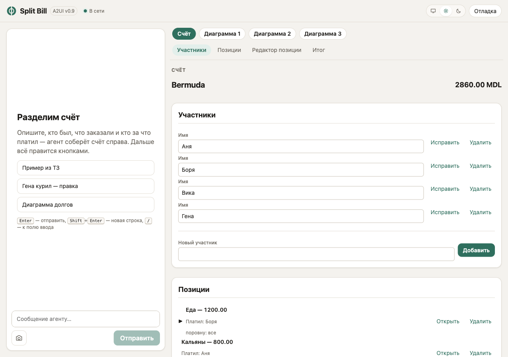
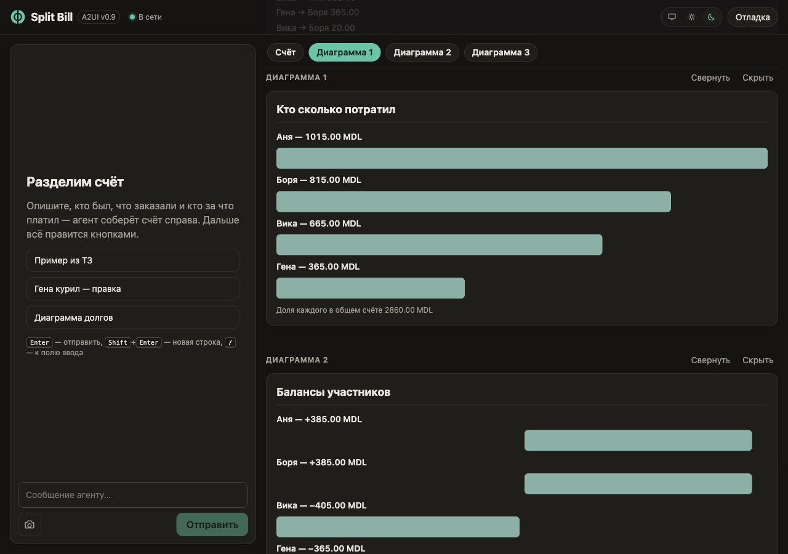
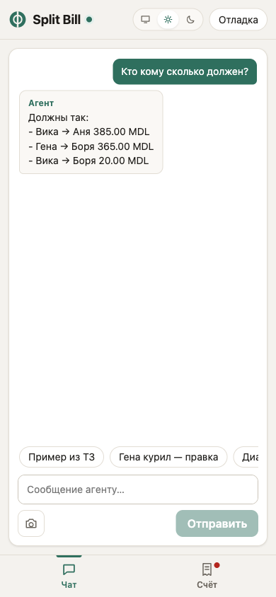
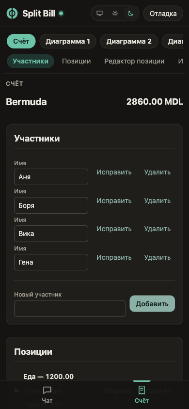

# Split Bill на A2UI v0.9 (участник №2)

Приложение для дележа счёта из ТЗ хакатона ([`../TZ.md`](../TZ.md)), собранное на **Google A2UI v0.9**: агент (Claude) описывает интерфейс декларативным JSON из базового каталога компонентов, клиент рисует его нативно через `@a2ui/react`. Деньги считает код, модель только вызывает тулы и рисует результат.

- Модель: `claude-opus-5-5` (общая для всех участников, меняется через `ANTHROPIC_MODEL`).
- Стек: тонкий TypeScript — Node + Express + `@anthropic-ai/sdk` (tool runner, стриминг) на сервере, Vite + React 19 + `@a2ui/react@0.12` / `@a2ui/web_core@0.12` на клиенте. ADK/A2A не используются.
- Отчёт: [`REPORT.md`](REPORT.md). Сценарий демо: [`docs/DEMO.md`](docs/DEMO.md).

## Запуск одной командой

Нужны Node ≥ 22 и доступ к Anthropic API. Проще всего через CLI `ant`: `brew install anthropics/tap/ant && ant auth login`, проверка — `ant auth status`. Вместо этого можно задать `ANTHROPIC_API_KEY` в `.env`.

```bash
cd a2ui
cp .env.example .env
npm install && npm run dev
```

`npm run dev` запускает сервер (порт 8787) и клиент. Откройте URL, который напечатает процесс `web`:

- обычно это Vite dev server `http://localhost:5173` (проксирует `/api` на 8787);
- если в пути к проекту есть `#` (например `~/workspaces/#hakaton/...`), Vite dev server не работает — скрипт сам переключается на `vite build --watch`, а приложение открывается на `http://localhost:8787`.

## Интерфейс



- **Две панели.** Слева чат с агентом, справа поверхности A2UI. Над поверхностями — липкая навигация: переключатель поверхностей («Счёт», «Диаграмма 1», …) и оглавление разделов счёта («Участники · Позиции · Редактор позиции · Итог»). Оглавление строится из заголовков карточек, которые нарисовала модель.
- **Телефон (< 860 px).** Одна панель за раз, внизу вкладки «Чат / Счёт»; точка на вкладке — там есть обновления. После первого счёта приложение само переключается на «Счёт». Строки поверхности переносятся (container query), горизонтальной прокрутки нет.
- **Тема.** Системная / светлая / тёмная — переключатель в шапке, выбор запоминается в браузере.
- **Новый счёт.** Кнопка в шапке (на узком экране — только иконка) после подтверждения стирает на сервере счёт, переписку с моделью и лог сообщений; чат и панель счёта возвращаются к пустому экрану во всех вкладках этой сессии. Тема и настройки отладки остаются. Пока агент отвечает, кнопка недоступна.
- **Поверхности.** Новая поверхность (S7) прокручивается в видимую область и подсвечивается; дополнительные поверхности можно свернуть или скрыть (локально, без `deleteSurface`).
- **Отладка.** Лог сообщений A2UI и замеры ходов (ТЗ §7) — в выдвижной панели «Отладка», по умолчанию закрыта, но данные собирает с загрузки страницы. Включить: `?debug=1` (запоминается; `?debug=0` выключает) или Ctrl/⌘+Shift+D. Ошибки рендера показываются коротким уведомлением, подробности — в панели.
- **Клавиши.** `Enter` — отправить, `Shift+Enter` — новая строка, `/` — к полю ввода, `Esc` — закрыть диалог/панель/уведомление, `Ctrl/⌘+Shift+D` — отладка, `Alt+1` / `Alt+2` — «Чат» / «Счёт» на телефоне.

| Тёмная тема и диаграммы | Телефон: чат | Телефон: счёт | Отладка |
|---|---|---|---|
|  |  |  |  |

Как выглядит поверхность, решают три вещи: CSS-токены (`web/src/styles/`), реализация `Button` с классами вариантов (`web/src/a2ui/catalog.tsx` — тот же каталог и catalogId, см. REPORT «Контроль внешнего вида») и блок `LAYOUT GUIDE` в системном промпте (порядок разделов, заголовки карточек, ≤ 4 элементов в строке шаблона, варианты кнопок, подсказки `/hints/*`).

## Как это устроено

```
a2ui/
  server/  Node + TS (tsx), express 5, @anthropic-ai/sdk, zod, ajv
    src/domain/      доменный контракт ТЗ §4: целые минорные единицы, allocate, BillStore, summary
    src/a2ui/        вендоренная спека v0.9.1, валидатор, конверты, потоковый разбор render_surface
    src/projector/   Bill → BillViewModel (готовые строки) и diff для updateDataModel
    src/agent/       системный промпт, тулы, раннер хода, диспетчер UI-действий, телеметрия
    src/http/        REST + SSE (/api/events)
    scripts/         smoke-s1, bench-s1, count-prompt-tokens
  web/     Vite + React 19 + @a2ui/react (v0_9)
    src/a2ui/        MessageProcessor, каталог (Button с вариантами), SSE-клиент и отправка действий
    src/components/  AppHeader, Chat, Surfaces/SurfaceFrame/SurfaceNav, MobileTabBar, DebugDrawer, Toast
    src/lib/         тема, настройки, логгер, горячие клавиши, оглавление (чистые функции с тестами)
    src/styles/      tokens, base, shell, surface
```

```
текст в чат ──POST /api/chat──▶ ход агента (Claude tool runner, stream)
     тулы: create_bill … get_summary (домен) + render_surface (UI)
     доменный тул ⇒ store ⇒ projector ⇒ diff ⇒ SSE a2ui: updateDataModel("bill", <изменённые пути>)
     render_surface ⇒ валидация ⇒ SSE a2ui: [deleteSurface] createSurface, updateComponents, updateDataModel
клик в UI ──POST /api/action {action, a2uiClientDataModel}──▶ таблица действий
     известное действие ⇒ домен ⇒ projector ⇒ diff ⇒ updateDataModel (без модели)
     неизвестное (remind) ⇒ агенту как сообщение «[UI action] …» (S8)
кнопка «Новый счёт» ──POST /api/reset──▶ Session.reset() (409, если агент занят)
     ⇒ SSE chat {type:"reset"} + deleteSurface на каждую поверхность; лог для переподключения пуст
SSE /api/events: a2ui | chat | status (токены, задержки, счётчики сообщений) | error
```

Три типа сообщений A2UI и сценарии:

| Сообщение | Когда | Сценарий |
|---|---|---|
| `createSurface` + `updateComponents` | модель один раз собирает дерево `bill` из каталога (или новую поверхность для S7) | S1, S7 |
| `updateDataModel` | код меняет данные; дерево не трогается | S2–S6 |
| `deleteSurface` | перерисовка поверхности по просьбе пользователя или откат неудачного стриминга | — |

- **UI-действия без модели.** Кнопки шлют `action` с контекстом (`{"itemId": {"path": "id"}}` внутри шаблона, `{"editor": {"path": "/editor"}}` для сохранения). Сервер сам вызывает домен и отвечает патчами данных — см. таблицу действий в `src/agent/actions.ts`.
- **Модель видит изменения из UI.** Перед следующим ходом в сообщение пользователя добавляется блок «[Состояние счёта изменено через интерфейс]». История только дописывается, поэтому кеш промпта не сбрасывается.
- **Стриминг (S10).** `render_surface` стримит вход (`eager_input_streaming`): поверхность создаётся, как только известен `surfaceId`, компоненты уходят пачками; после полной валидации приходят данные или поверхность удаляется, а ошибки уходят модели на исправление.

## Переменные окружения

| Переменная | По умолчанию | Что делает |
|---|---|---|
| `ANTHROPIC_MODEL` | `claude-opus-5-5` | модель агента |
| `ANTHROPIC_EFFORT` | `medium` | `output_config.effort` (`low`…`max`) |
| `ANTHROPIC_FALLBACKS` | `default` | серверный fallback при отказе модели; `off` — всегда одна модель |
| `A2UI_STREAM` | `1` | `0` — дерево приходит целиком после вызова тула |
| `LOG_LEVEL` | `info` (`debug` в `.env.example`) | уровень логов сервера |
| `PORT` | `8787` | порт API |
| `A2UI_DEBUG` | — | `1` включает `POST /api/debug/seed` (контрольный пример + эталонное дерево без модели; только для проверки). Не путать с `?debug=1` в браузере — это панель отладки клиента |

## Тесты и замеры

```bash
npm test                                               # сервер: домен, валидатор, проектор, действия, тулы, стриминг; web: lib + каталог (node:test)
npm run typecheck
npm -w server run smoke:s1                             # S1 + S6 на живой модели, таблица PASS/FAIL
npm -w server run bench:s1 -- --runs 10                # S1 ×10: надёжность, токены, задержки → bench/
npm -w server run bench:s1 -- --runs 5 --scenario s5   # S5
npm -w server run count:prompt                         # размер системного промпта в токенах
```

`GET /api/log?sessionId=…` отдаёт телеметрию ходов; `GET /api/debug/bill?sessionId=…` — счёт и итог как они лежат на сервере.
